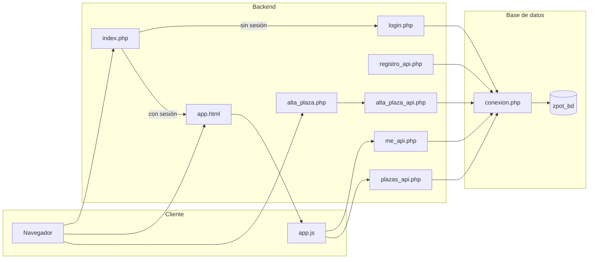

## Document structure

### 1. Introducción y árbol de directorios

- Un párrafo breve: Zpot es una aplicación web de alquiler de plazas de aparcamiento (backend PHP, MySQL, frontend HTML/CSS/JS).
- Árbol de directorios de todos los archivos relevantes, por ejemplo:

```text
Grupo3-main/
├── README.md
├── docs/
│   ├── arquitectura.md
│   └── estructura-y-conexiones.md   (this new file)
├── database/
│   ├── schema.sql
│   └── zpot_bd.sql
├── frontend/
│   └── index.html
└── backend/
    ├── index.php
    ├── app.html, app.css, app.js
    ├── alta_plaza.php, alta_plaza_api.php
    ├── plazas_api.php, reserva.php
    └── sesion/
        ├── conexion.php
        ├── login.php, logout.php
        ├── registro.php, registro_api.php
        ├── signup.html, signup.css
        └── me_api.php
```

### 2. Capa de base de datos (cómo se conecta)

- **database/schema.sql:** Breve nota: esquema inicial de referencia; el esquema real está en `zpot_bd.sql`.
- **database/zpot_bd.sql:** Fuente única: crea usuario `admin`, BD `zpot_bd`, tablas USUARIO, PLAZA, RESERVA (con FKs) y datos de ejemplo (usuario demo + 8 plazas con precios). Todos los scripts PHP que usan la BD asumen que se ha ejecutado.

Nota breve: **conexion.php** es el único punto que abre la conexión MySQL; todo script del backend que toca la BD lo incluye (directamente o vía `sesion/conexion.php`).

### 3. Entrada al backend y flujo de autenticación

- **index.php:** Punto de entrada. Inicia sesión; si no hay `$_SESSION['usuario']` redirige a `sesion/login.php`, si no a `app.html`. No devuelve HTML.
- **conexion.php:** Define `$_conexion` (mysqli a `zpot_bd` con usuario `admin`). Lo requieren login, registro, registro_api, me_api, plazas_api, alta_plaza_api (y opcionalmente registro.php). No toca sesión; solo BD.

Documentar **sesión/autenticación** y cómo se enlazan las páginas:

- **Login (login.php):** Requiere `conexion.php`; en POST valida email/contraseña contra USUARIO, pone `$_SESSION['usuario'] = email`, redirige a `../index.php`. Renderiza el formulario de login.
- **Logout (logout.php):** Limpia la sesión y redirige a `login.php`. Enlazado desde el menú de la app.
- **Registro (dos flujos):**
  - **registro.php** — legado: formulario PHP + Bootstrap, POST a sí mismo, inserta en USUARIO, usa `conexion.php`.
  - **signup.html** + **registro_api.php** — flujo actual: formulario HTML estático, validación en cliente, `fetch(POST)` a `registro_api.php` (JSON); la API valida, inserta en USUARIO, inicia sesión, devuelve JSON. Usa `conexion.php`.
- **signup.css** — estilos del formulario de registro (y de alta_plaza): card, form-group, botones, tokens (negro/blanco/amarillo).

Incluir un diagrama **flujo de autenticación** (mermaid, con etiquetas en español): invitado → login o registro → sesión establecida → index.php → app.html; app.html y las APIs usan la sesión para el “usuario actual”.

### 4. APIs (JSON, sesión, BD)

- **me_api.php:** GET. Requiere sesión; devuelve JSON del usuario actual (DNI, nombre, apellidos, email, displayName) desde USUARIO por `$_SESSION['usuario']` (email). Lo usa app.js para comprobar autenticación.
- **plazas_api.php:** GET. Requiere sesión; devuelve JSON `{ plazas: [...] }` desde PLAZA con JOIN a USUARIO (propietario). Lo usa app.js para cargar los marcadores del mapa.
- **alta_plaza_api.php:** POST JSON (direccion, foto, ancho, largo, descripcion, precio). Requiere sesión; obtiene DNI desde la sesión (nunca del cliente), valida, inserta en PLAZA, devuelve `{ success, id }`. Lo usa el formulario de alta_plaza.php.

En una frase por API: todas usan sesión para autenticación y (salvo me_api) incluyen `sesion/conexion.php` para la BD.

### 5. Aplicación principal (mapa e interfaz)

- **app.html:** Carcasa de la app: barra de navegación (logo → index.php, búsqueda, filtros, menú cuenta con “Añadir mi plaza” → alta_plaza.php, “Cerrar sesión” → sesion/logout.php), contenedor del mapa, panel de detalle, banner de éxito al crear plaza. Carga app.css, Leaflet, app.js.
- **app.css:** Variables de diseño (p. ej. --accent amarillo), navbar, mapa, panel de detalle, menú cuenta, banner de éxito. Compartido con reserva.php y el resto de la app.
- **app.js:** Al cargar: llama a me_api (auth), plazas_api (datos), inicializa mapa Leaflet, coloca marcadores (con posiciones por defecto si la plaza no tiene lat/lng). Gestiona filtros, menú cuenta, panel de detalle, enlace “Reservar” a reserva.php. Si la URL tiene `?plaza_created=1`, muestra el banner de éxito y limpia la URL.

Diagrama opcional: **flujo de peticiones** — Navegador carga app.html → app.js → me_api.php + plazas_api.php (same-origin, credentials) → JSON → mapa y marcadores.

### 6. Flujo “Añadir plaza”

- **alta_plaza.php:** Página protegida (redirige a login si no hay sesión). Formulario: dirección (obligatoria), URL foto, ancho, largo, descripción, precio. Validación en cliente; envío por fetch a alta_plaza_api.php; al éxito redirige a app.html?plaza_created=1. Usa sesion/signup.css.
- Enlace desde la app: menú cuenta → “Añadir mi plaza” → alta_plaza.php.

### 7. Reserva (placeholder)

- **reserva.php:** Página protegida; recibe `id_plaza`; placeholder del futuro flujo RESERVA. Usa app.css. Enlazado desde el panel de detalle “Reservar” en app.js.

### 8. Frontend (independiente)

- **frontend/index.html:** Página estática mínima (título “Zpot”). Sin conexión con backend ni base de datos; se puede indicar como entrada alternativa o legado.

### 9. Raíz y documentación existente

- **README.md:** Introducción al proyecto, tecnologías, configuración de la BD (zpot_bd.sql), mapa (Leaflet/CARTO).
- **docs/arquitectura.md:** Arquitectura de alto nivel (front/back, HTTP/JSON, SQL). El nuevo documento lo referenciará y bajará al detalle por archivos.

### 10. Resumen de conexiones (referencia rápida)

Una sección o tabla breve que resuma **cómo se conectan**:

- **BD:** conexion.php → usado por login, registro, registro_api, me_api, plazas_api, alta_plaza_api (y registro.php).
- **Sesión:** Establecida por login.php o registro_api.php; leída por index.php, me_api, plazas_api, alta_plaza_api, alta_plaza.php, reserva.php; destruida por logout.php.
- **Identidad del usuario:** Siempre desde `$_SESSION['usuario']` (email) en el servidor; el DNI se resuelve en PHP desde USUARIO (p. ej. en me_api, alta_plaza_api).
- **Flujo de UI:** index.php → app.html ↔ app.js ↔ plazas_api / me_api; app.html → alta_plaza.php → alta_plaza_api.php → app.html?plaza_created=1; detalle en app.html “Reservar” → reserva.php.

No se modifica código de la aplicación; solo se añade este único `.md` en `docs/`.

## Diagrama opcional (Mermaid)

Un diagrama de flujo puede resumir los flujos principales (etiquetas en español):



Se incluirá en el documento para ilustrar “cómo se conectan” los componentes.

## Archivo a crear

| Archivo | Contenido |
|--------|-----------|
| **docs/estructura-y-conexiones.md** | Todo el contenido anterior redactado **en español**: introducción, árbol, capa BD, entrada y auth, APIs, app principal, flujo añadir plaza, reserva, frontend, referencia a README/arquitectura, resumen de conexiones y diagrama Mermaid (con etiquetas en español). |

## Resumen

- **Un solo archivo nuevo:** `docs/estructura-y-conexiones.md`.
- **Contenido:** Descripción por archivo (qué hace, qué usa, qué lo usa) y “cómo se conectan” (entrada, sesión, BD, APIs, flujos de UI), **todo en español**.
- **Sin cambios** en el código ni en README/arquitectura; solo se añade este `.md` en `docs/`.

